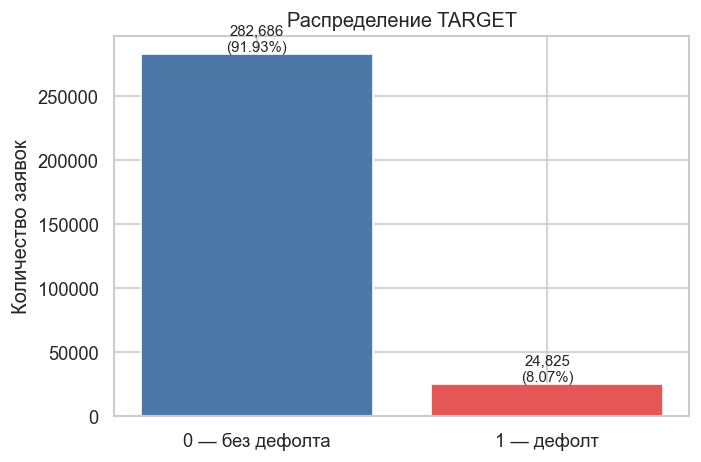
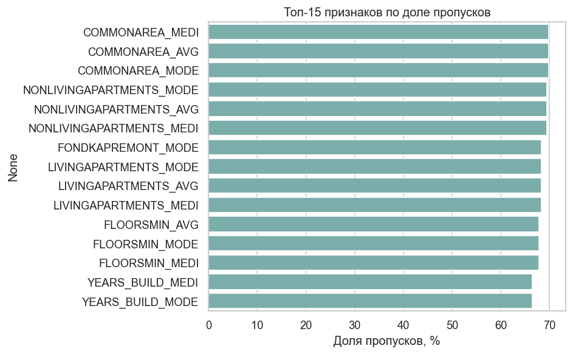
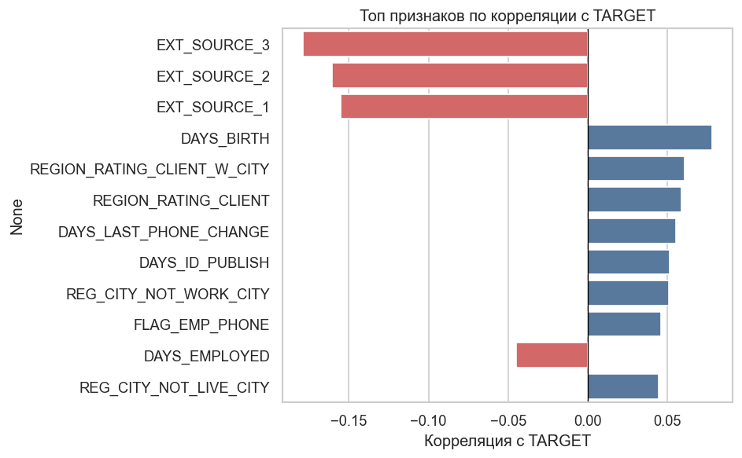
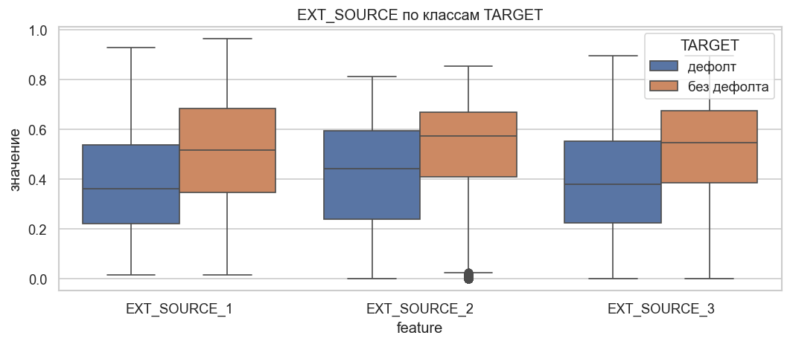
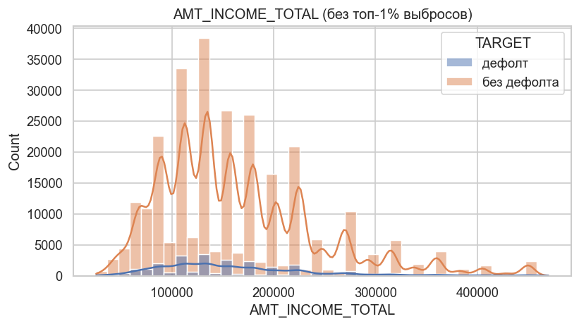
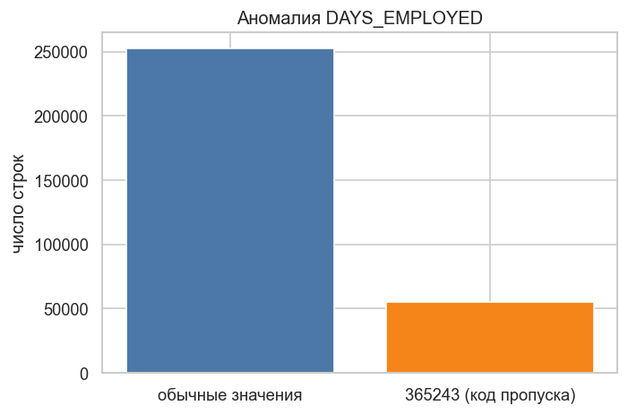
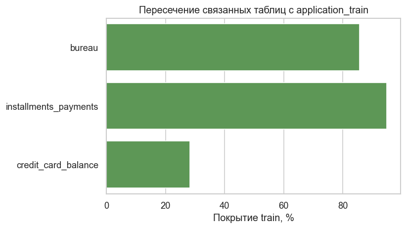

# HW4. Data Understanding — Home Credit Default Risk

Проект: AI-система оценки финансового риска и поведенческого профиля клиента.  

**Файлы HW4:**

| Файл | Назначение |
|------|------------|
| `data_understanding_hw4.md` | отчёт (этот документ) |
| `scripts/dataset_quality_eda.py` | код EDA + построение графиков |
| `reports/figures/*.png` | визуализации |
| `reports/dataset_quality_summary.json` | числовая сводка |

EDA выполнен скриптом `scripts/dataset_quality_eda.py`.

---

## 1. Источник и состав данных

**Источник:** [Kaggle — Home Credit Default Risk](https://www.kaggle.com/competitions/home-credit-default-risk) (соревнование, данные ~2018).

**Целевая переменная (MVP):** `TARGET` в `application_train.csv` — `1` дефолт по кредиту, `0` без дефолта.

**Основная таблица:** `application_train.csv` — одна строка = одна заявка (`SK_ID_CURR`); анкета, `AMT_INCOME_TOTAL`, `NAME_INCOME_TYPE`, сумма кредита, внешние скоринги `EXT_SOURCE_1/2/3` и др. Объём: **307 511** строк, **122** признака.

**Связанные таблицы** (один клиент заявки — `SK_ID_CURR`, join на этапе feature engineering):

| Таблица | Назначение |
|---------|------------|
| `bureau`, `bureau_balance` | Кредиты в других организациях |
| `previous_application` | Прошлые заявки в Home Credit |
| `installments_payments` | История платежей по прошлым кредитам |
| `credit_card_balance`, `POS_CASH_balance` | Балансы по продуктам |

**Покрытие клиентов train** (пересечение по `SK_ID_CURR`): bureau ~86%, installments ~95%, POS ~94%, credit_card ~28%. Для поведенческих фич опираемся на installments и bureau; карточный баланс — дополнительно, с учётом малого покрытия.

**Ограничение данных:** нет банковской выписки с категориями поступлений. Этап 2 (подозрительные паттерны дохода) — прокси по платежам и балансам, не юридическая «недекларация».

**Scope:** MVP — скоринг дефолта; расширение — флаги подозрения (отдельно от `TARGET`).

---

## 2. Базовый EDA и выводы для моделирования

Ниже — **выводы**; **фактура анализа** (код и графики) — в `scripts/dataset_quality_eda.py` и `reports/figures/`.

### 2.1 Распределение целевой переменной

Дисбаланс классов: дефолт **8,07%** — нужен stratified split и метрики помимо accuracy.

### 2.2 Пропуски

Максимальны признаки жилья (~66–70%); у `EXT_SOURCE_1` — **56%**, `EXT_SOURCE_3` — **20%**, `EXT_SOURCE_2` — **0,2%**.

### 2.3 Связь признаков с TARGET

Сильнее всего связаны внешние скоринги; у дефолта ниже `EXT_SOURCE_3` и медиана дохода (135k vs 148,5k).

### 2.4 Аномалии и покрытие таблиц

`DAYS_EMPLOYED == 365243` — **55 374** строк (18%) → заменить на NaN.

Installments/bureau ~85–95% train; credit_card ~28%.

### 2.5 Выводы для modeling

**Качество ключей:** дубликатов `SK_ID_CURR` — 0.

**Типы признаков:** 106 числовых, 16 категориальных.

**Топ |corr| с TARGET:** `EXT_SOURCE_3` (0,18), `EXT_SOURCE_2` (0,16), `EXT_SOURCE_1` (0,16), `DAYS_BIRTH` (0,08).

**Выводы:**

- Обязательная обработка пропусков; высокопропущенные блоки жилья — drop или флаг missing.
- `DAYS_EMPLOYED`: 365243 → NaN, затем impute.
- Категориальные — encoding / cat в бустинге.
- Поведенческий слой — join `installments_payments`, `bureau` на `SK_ID_CURR`.
- Метрики: AUC-ROC, PR-AUC; только **stratified** разбиение.

---

## 3. Качество разметки и использование TARGET

**Распределение:** без дефолта — 282 686 (91,93%), дефолт — 24 825 (8,07%). Сильный дисбаланс — stratified K-Fold и интерпретация порогов с осторожностью.

**Sanity-checks:** медиана `EXT_SOURCE_3` у дефолта 0,379 vs 0,546 без дефолта; медиана дохода 135 000 vs 148 500 — разметка согласуется с ожидаемым риском.

**Reject inference:** `TARGET` наблюдаем только по выданным кредитам; модель применима к похожему потоку одобренных заявок.

**Как работать с разметкой (не «улучшать» синтетически):**

1. Не переопределять `TARGET` в MVP (сопоставимость с benchmark).
2. Stratified K-Fold / split при обучении и оценке.
3. Калибровка вероятностей и проверка по сегментам — для продуктовых выводов.
4. Прокси подозрений по доходу (этап 2) — отдельные признаки/скор, **не** подмена `TARGET`.

---

## 4. Формирование выборки и стратегия валидации

**Единица наблюдения:** заявка (`SK_ID_CURR`). Обучающая выборка: 307 511 заявок (`application_train`).

**Сегмент гипотезы (прототип):** клиенты с непустой историей в `installments_payments` и/или `credit_card_balance` / `POS_CASH_balance` после left join; точный размер фиксируется в ноутбуке моделирования.

**Валидация:**

1. **Stratified K-Fold**, k = 5, `shuffle=True`, `random_state=42` — основная оценка AUC и **прироста AUC** относительно baseline.
2. **95% доверительный интервал** — по фолдам (t-интервал) и/или bootstrap по out-of-fold предсказаниям; для сравнения двух моделей — на одних и тех же фолдах.
3. Опционально: hold-out 20% (stratified) для финального отчёта.
4. **Baseline:** логистическая регрессия на анкете + агрегаты bureau без поведенческих фич; сравнение с моделью с поведением на одинаковых сплитах.

**Проверка гипотезы:** H0 — прирост AUC = 0; подтверждение — 95% доверительный интервал для прироста не включает 0, нижняя граница не ниже порога (например 0,02).

**Контроль сплитов:** размеры тестовых фолдов — 61 503 / 61 502 × 4; доля `TARGET=1` в каждом фолде — 0,0807 (стратификация работает).
