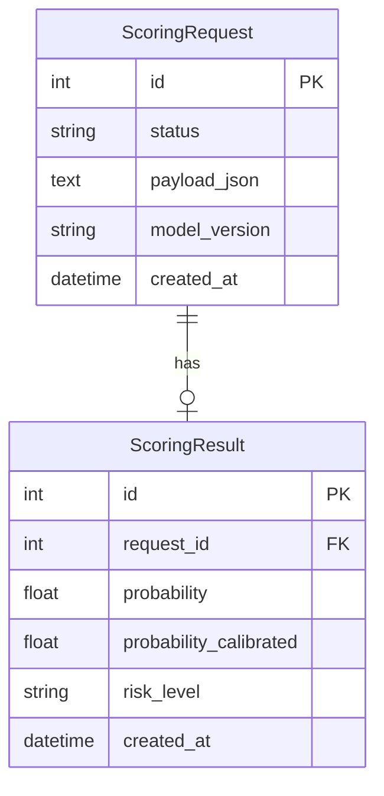

# Доменная модель — Home Credit Scoring MVP

## Контекст

Сервис принимает **заявку на кредит**, ставит задачу в очередь, **воркер с ML-моделью** (HW7) считает вероятность дефолта, результат сохраняется в **PostgreSQL**.

## Сущности

| Сущность | Описание |
|----------|----------|
| **ScoringRequest** | Заявка на скоринг: JSON с полями клиента, статус (`pending` → `processing` → `completed` / `failed`) |
| **ScoringResult** | Результат: сырая и калиброванная вероятность дефолта, уровень риска (`low` / `medium` / `high`) |

## ER-диаграмма



## Поток данных

```
UI / REST  →  API  →  PostgreSQL (ScoringRequest)
                  ↓
              RabbitMQ (scoring_jobs)
                  ↓
         Worker × N  →  LGBM + Isotonic  →  PostgreSQL (ScoringResult)
```

## Уровни риска

| P(дефолт) | risk_level |
|-----------|------------|
| < 10% | low |
| 10–25% | medium |
| ≥ 25% | high |

## Вне домена (инфраструктура)

- **RabbitMQ** — очередь задач (не доменная сущность)
- **Артефакты модели** — `artifacts/model.joblib` (read-only)
